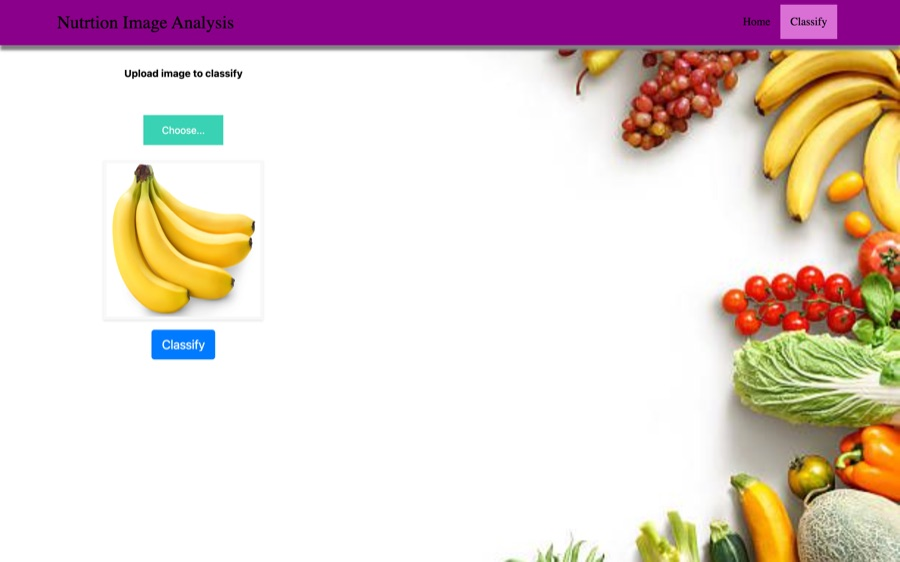
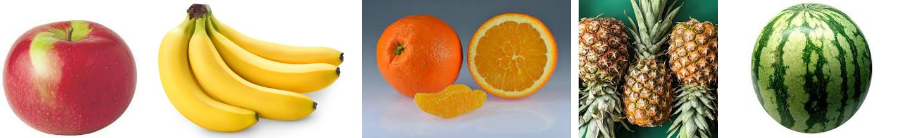
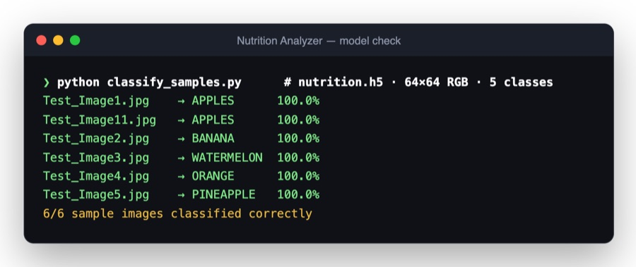

<div align="center">

# AI-Powered Nutrition Analyzer

**Snap a fruit, get its nutrition facts. A deep-learning image classifier plus a live nutrition API, built for fitness enthusiasts who'd rather not look everything up.**




</div>

---

## The problem

Tracking what you eat is tedious: search a database, guess the serving, copy the numbers. For whole foods like fruit, a photo should be enough.

## How it works



1. **Upload a photo.** The web app previews it instantly.
2. **Classify.** A convolutional neural network trained on five fruit classes (apples, bananas, oranges, pineapples, watermelons) predicts what's in the picture.
3. **Get the nutrition.** The predicted food is sent to the **CalorieNinjas** API, and its nutrition record (calories, protein, carbohydrates, fat, sugar, fibre and more) is shown alongside the prediction.

## Model results



On the bundled sample images, the model gets **6 of 6 right**. Reproduce it with:

```sh
python docs/classify_samples.py
```

## Tech

| Layer | Details |
|---|---|
| Model | Keras CNN on 64×64 RGB images, trained with `ImageDataGenerator` augmentation (`training/`) |
| Serving | Flask app (`app.py`) loading `nutrition.h5`, with upload → predict → nutrition lookup |
| Nutrition data | CalorieNinjas via RapidAPI |
| Cloud | Model trained and deployed with IBM Watson Studio / Watson Machine Learning (`training/model_training_on_ibm_cloud.ipynb`) |

## Run it locally

```sh
pip install flask tensorflow pillow requests
export RAPIDAPI_KEY=your-rapidapi-key        # CalorieNinjas on RapidAPI
python app.py                                # → http://127.0.0.1:5000
```

Try it with the photos in `Sample_Images/`.

## Team

Built for the IBM Nalaiya Thiran program (project IBM-Project-22536, team PNT2022TMID26372, 2022) by **Keerthana VS, Maya Padhy, Madhubala R, Rasika M and Roszhan Raj MS**. The full write-up is in [`docs/project-report.pdf`](docs/project-report.pdf).
